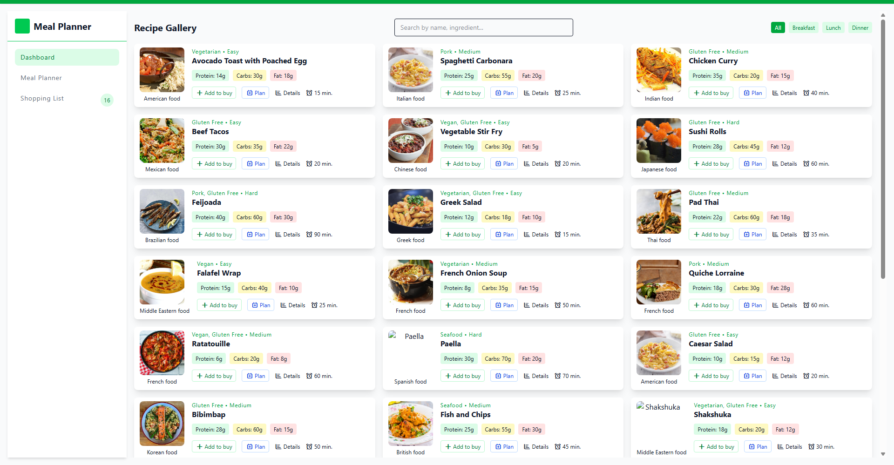
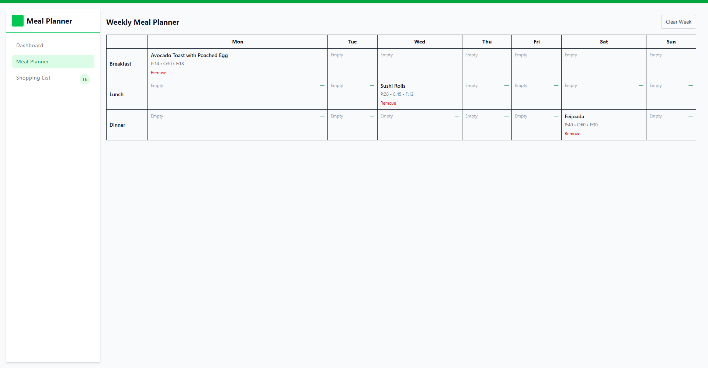
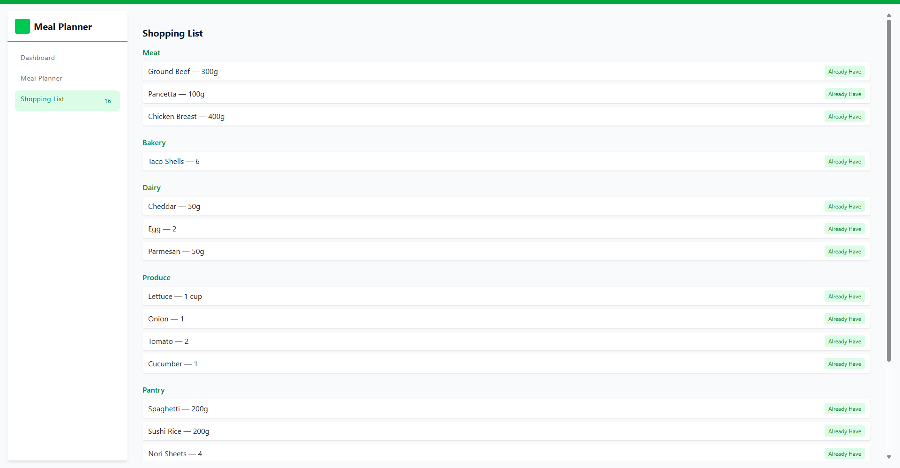

<div align="center">
  
  <h1>Anderson Toledo Martins Moreira</h1>
</div>

<div align="center">

[](https://docs.google.com/document/d/1I8T4Mkb61NsTKN14ZbT1mnQKAc9LqiiPtgrYf9ayH1c/edit?usp=sharing)
[](https://docs.google.com/document/d/1vnFlRP3myxexgHk5Y6XaCKQGETPQwCygPZqGSblwCXg/edit?usp=sharing)

</div>

<div align="center">

[](https://www.linkedin.com/in/atmmoreira)
[](mailto:atmmoreira.rj@gmail.com?subject=From%20GitHub&cc=atmmoreira.rj@gmail&body=Hi,%20there.%20Found%20you%20from%20GitHub.)
[_9.9289.0362-black?color=2ecc71&labelColor=27ae60&logo=whatsapp&logoColor=ffffff>)](https://api.whatsapp.com/send?phone=5521992890362)

</div>

## Objective

You're building a personal recipe management and meal planning application that helps home
cooks organize their favorite recipes, plan weekly meals, and generate smart shopping lists.

## Layout

<p align="center">
  
</p>

<p align="center">
  
</p>

<p align="center">
  
</p>

## Tecnologies

```bash
# Technical Requirements
- Technologies
- React + TypeScript
- TailwindCSS for responsiveness
- LocalStorage for persistence
- DDD + Clean Architecture (Domain, Application, Infrastructure, Presentation)
- Mock Data in recipe.json with 30+ recipes
```

## Architecture

```
📁 src
 ├── 📁 Application
 │    └── 📁 UseCases
 │         ├── AddRecipe.ts
 │         ├── GenerateShoppingList.ts
 │         ├── PlanMeal.ts
 ├── 📁 Data
 │    └── recipe.json
 ├── 📁 Domain
 │    ├── 📁 Entities
 │    │     ├── MealPlan.ts
 │    │     ├── Recipe.ts
 │    │     ├── ShoppingList.ts
 │    └── 📁 Repositories
 │          ├── RecipeRepository.ts
 ├── 📁 Infrastructure
 │    └── 📁 Repositories
 │          ├── LocalStoragePlannerRepository.ts
 │          ├── LocalStorageRecipeRepository.ts
 │          ├── LocalStorageIngredientRepository.ts
 ├── 📁 Presentation
 │    ├── 📁 components
 │    │     ├── MealPlanner.tsx
 │    │     ├── RecipeCard.tsx
 │    │     ├── RecipeGallery.tsx
 │    │     ├── RecipeModal.tsx
 │    │     ├── ShoppingListView.tsx
 │    └── 📁 pages
 │          ├── Dashboard.tsx
 ├── App.tsx
 ├── main.tsx
 └── main.css
```

## Run this project

```bash
npm i
npm run dev
```

## Technical Decisions

- DDD + Clean Architecture: separation of responsibilities between Domain, Application, Infrastructure, and Presentation.
- LocalStorage: chosen for simplicity, it meets the test scope well.
- JSON: used instead of an external API (to avoid CORS and speed up setup).
- Incremental Persistence: planner and shopping list are automatically synchronized.
- TailwindCSS: increased productivity and responsiveness.

## I use AI to help me

- ChatGPT was used to accelerate the writing of basic entities, repositories, and initial examples.
- Manual adaptations included:
  - Improved typing in TypeScript
  - Integration with LocalStorage
  - UI refinement with TailwindCSS
  - Architectural organization
- All code was manually reviewed and adjusted before delivery.

## If I had more time...

- Advanced filters in the Recipe Gallery
  - Preparation time range (e.g., up to 15 min, 30 min, 1h+).
- Estimated cost calculation for the Shopping List
  - Associate ingredients with average prices.
  - Show estimated purchase total.
  - Update automatically as items are selected/deselected.
- Manually add ingredients and recipes
  - Field to add items directly to the shopping list.
  - "New Recipe" button for users to create their own recipes.
- Recipe import via URL
  - Service that scrapes or uses an external API to automatically import titles, ingredients, and instructions.
- Authentication and multi-user system
  - Simple login (JWT / OAuth).
  - Each user would have their own planner and list.
- Real API Integration
  - Replace JSON seed with an API (FatSecret, Spoonacular, TheMealDB).
  - Allow recipes to be updated in real time.
- More advanced nutritional dashboard
  - Graphs (Recharts or Chart.js) to display macronutrient ratios.
  - Automatically balanced meal recommendations.
- Better mobile experience
  - Drag & drop to plan meals on mobile.
  - UI optimized for smaller screens.
- Automated testing
  - Coverage with Jest + React Testing Library in core components.
  - Integration tests for use cases (PlanMeal, GenerateShoppingList).
- Deployment and CI/CD
  - Automatic deployment to Vercel or Netlify.
  - GitHub Actions running lint + tests before each PR.
